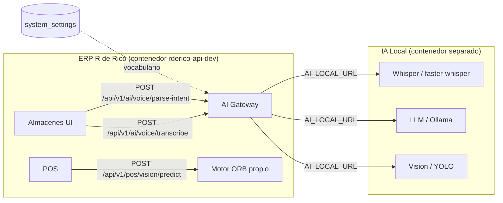

# 🧠 ESPECIFICACIÓN: AI GATEWAY TRANSVERSAL — R de Rico ERP

> **Estado:** 📋 Especificación (Fase 7 del plan de almacenes v7)
> **Prerequisito bloqueante:** Instalación del módulo **IA Local** en el servidor (Whisper + LLM).
> **Naturaleza:** Proyecto **transversal** — NO pertenece al roadmap de almacenes.

---

## 1. POR QUÉ ES UN PROYECTO SEPARADO

La Fase 7 del [`PLAN_MAESTRO_ALMACENES_V7.md`](../plans/PLAN_MAESTRO_ALMACENES_V7.md:732) declara explícitamente:

> *"Esta fase **no debería pertenecer al roadmap de almacenes**. Es un módulo transversal (POS, Almacenes, RRHH). Debe ser su propio proyecto con su propia especificación."*

**Razón técnica:** el AI Gateway es infraestructura compartida. Almacenes es solo **uno** de sus consumidores. Si el gateway viviera dentro del roadmap de almacenes, cualquier otro módulo (POS, RRHH, Reparto) tendría que depender del ciclo de vida de almacenes para poder usar IA.

### 1.1 Consumidores actuales y futuros

| Módulo | Endpoint consumido | Estado |
|---|---|---|
| **Almacenes** | `/voice/transcribe`, `/voice/parse-intent` | ✅ Contrato implementado (Fase 6.5) |
| **Almacenes** | `/vision/detect` | ✅ Contrato implementado (Fase 6) |
| **POS** | `/vision/predict` (motor ORB propio, no el gateway) | ✅ Operativo |
| **RRHH** | *(futuro)* | ⏳ No iniciado |
| **Reparto Grandeza** | *(futuro)* | ⏳ No iniciado |

---

## 2. ESTADO ACTUAL (lo que YA existe)

El gateway **ya está construido como contrato** en la Fase 5. Lo único que falta es el motor real.

### 2.1 Componentes existentes

| Capa | Archivo | Rol |
|---|---|---|
| Contratos | [`schemas.py`](../apps/api/modules/ai/schemas.py:1) | Pydantic: `VisionDetectRequest/Response`, `VoiceTranscribeRequest/Response`, `VoiceParseIntentRequest/Response` |
| Servicio | [`service.py`](../apps/api/modules/ai/service.py:1) | Capa de delegación con fallback 503 |
| Endpoints | [`router.py`](../apps/api/modules/ai/router.py:1) | `GET /status`, `POST /vision/detect`, `POST /voice/transcribe`, `POST /voice/parse-intent` |
| Registro | [`main.py`](../apps/api/main.py:1) | Router montado en `/api/v1/ai` |

### 2.2 Mecanismo de fallback (ya operativo)

El servicio [`service.py`](../apps/api/modules/ai/service.py:32) controla la disponibilidad por variables de entorno:

```python
def _ia_habilitada() -> bool:
    """Por defecto esta APAGADA: el sistema arranca en modo manual."""
    valor = os.getenv("AI_LOCAL_ENABLED", "false").strip().lower()
    return valor in ("1", "true", "yes", "on")

def _url_motor_ia() -> str:
    """URL base del motor de IA Local (Whisper + LLM). Vacio si no se configuro."""
    return os.getenv("AI_LOCAL_URL", "").strip()
```

Si `AI_LOCAL_ENABLED=false` **o** `AI_LOCAL_URL` está vacío → **HTTP 503** con:

```json
{
  "detail": {
    "codigo": "IA_NO_DISPONIBLE",
    "mensaje": "El motor de IA Local no esta disponible. Continue en modo manual."
  }
}
```

### 2.3 Variables de entorno

| Variable | Default | Descripción |
|---|---|---|
| `AI_LOCAL_ENABLED` | `false` | Interruptor maestro. `false` = modo manual puro |
| `AI_LOCAL_URL` | *(vacío)* | URL base del motor local (ej. `http://ia-local:8000`) |

### 2.4 Evidencia de verificación (IA apagada)

| Prueba | Resultado |
|---|---|
| `GET /api/v1/ai/status` | `200` — `{"habilitada":false,"configurada":false,"disponible":false,"codigo_fallback":"IA_NO_DISPONIBLE"}` |
| `POST /api/v1/ai/voice/transcribe` | `503` — fallback correcto |
| `POST /api/v1/ai/voice/parse-intent` | `503` — fallback correcto |
| Vitest | `74/74 PASS` |
| pytest | `21/21 PASS` |

---

## 3. LO QUE FALTA (el motor real)

### 3.1 Componentes a implementar

| Componente | Endpoint | Caso de uso | Tecnología sugerida |
|---|---|---|---|
| **Whisper local** | `/voice/transcribe` | Dictar "20 kilos de harina" | `faster-whisper` (CTranslate2) o `whisper.cpp` |
| **LLM local** | `/voice/parse-intent` | Texto → JSON estructurado | Ollama + Llama 3.1 8B / Qwen 2.5 7B |
| **Visión** | `/vision/detect` | Detección de objetos en imagen | YOLOv8 / RT-DETR (o reutilizar ORB existente) |

### 3.2 Punto de inserción en el código

En [`service.py`](../apps/api/modules/ai/service.py:73), cada función stub tiene un comentario que marca el punto exacto de delegación:

```python
async def transcribir_voz(payload: schemas.VoiceTranscribeRequest) -> schemas.VoiceTranscribeResponse:
    """Proxy Whisper. Stub: 503 si el motor no esta disponible."""
    if not _ia_habilitada() or not _url_motor_ia():
        _lanzar_no_disponible("transcripcion")
    # Fase 7: aqui se delegara a Whisper local.   <-- PUNTO DE INSERCIÓN
    _lanzar_no_disponible("transcripcion no implementada")
```

La implementación real reemplaza la línea `_lanzar_no_disponible(...)` final por una llamada HTTP al motor local:

```python
    # Fase 7 (implementacion real):
    async with httpx.AsyncClient(timeout=30.0) as client:
        res = await client.post(
            f"{_url_motor_ia()}/transcribe",
            json={"audio_base64": payload.audio_base64, "idioma": payload.idioma},
        )
        res.raise_for_status()
        data = res.json()
    return schemas.VoiceTranscribeResponse(**data)
```

> **Regla de oro:** el `try/except` debe degradar a 503, **nunca** propagar un 500. Un fallo de IA jamás debe romper una operación de almacén.

---

## 4. REGLA SaaS (CRÍTICA)

> **El vocabulario y las palabras clave provienen de `system_settings`, nunca hardcodeados.**
> — Sección 10 del Contexto Maestro, citada en [`PLAN_MAESTRO_ALMACENES_V7.md`](../plans/PLAN_MAESTRO_ALMACENES_V7.md:745)

### 4.1 Implicación de diseño

El LLM **no** debe llevar un prompt con la lista de insumos escrita en el código. En su lugar:

1. El frontend envía `skus_disponibles` en el `VoiceParseIntentRequest` (ya implementado).
2. El motor construye el prompt **dinámicamente** con esa lista.
3. Los sinónimos ("harina", "azúcar", "mantequilla") se leen de `system_settings`.

### 4.2 Anti-patrón detectado y documentado

[`VoiceAgentService.js`](../apps/voice-agent/VoiceAgentService.js:1) es un **mock** con datos falsos hardcodeados (`getTodaysMargin()`, `getCriticalInventory()`, etc.). Viola la regla SaaS y **no debe usarse en producción**. Ya está marcado con un banner de advertencia crítica.

---

## 5. MANEJO DE FALLOS

> *"Si Whisper/LLM no responde, degradar a entrada manual con toast informativo. Nunca bloquear la operación de almacén por fallo de IA."*
> — [`PLAN_MAESTRO_ALMACENES_V7.md`](../plans/PLAN_MAESTRO_ALMACENES_V7.md:749)

### 5.1 Matriz de degradación

| Escenario | Comportamiento esperado |
|---|---|
| IA apagada (`AI_LOCAL_ENABLED=false`) | 503 → toast → operador usa entrada manual |
| IA encendida pero motor caído | `httpx` lanza excepción → capturar → 503 → toast |
| Timeout del motor (>30s) | `httpx.TimeoutException` → 503 → toast |
| Respuesta malformada del motor | `ValidationError` → 503 → toast |
| Confianza baja (<0.7) | 200 con `confianza` baja → UI resalta en ámbar → operador revisa |

### 5.2 Principio human-in-the-loop

> *"La IA propone, el operador confirma. Nunca registrar stock automáticamente sin confirmación humana."*

Este principio ya está blindado en el frontend:
- [`mapVoiceIntentToProposal()`](../apps/inventory/utils/warehouseMappers.js:294) nace con `confirmado: false`.
- [`validateVoiceEntry()`](../apps/inventory/utils/warehouseMappers.js:329) rechaza el registro sin confirmación explícita.
- [`mapVisionDetectionsToProposals()`](../apps/inventory/utils/warehouseMappers.js:206) aplica el mismo patrón.

**El motor real NO debe romper este contrato.** Aunque el LLM devuelva `confianza: 0.99`, el operador sigue confirmando.

---

## 6. ARQUITECTURA PROPUESTA



### 6.1 Decisión de despliegue

| Opción | Ventaja | Desventaja |
|---|---|---|
| **Contenedor separado** (recomendado) | Aislamiento total; el API del ERP no carga modelos en RAM | Requiere GPU/CPU dedicada |
| **Proceso en el mismo host** | Menor latencia | Compite por RAM con el ERP; riesgo de tumbar el POS |

**Recomendación:** contenedor separado con `AI_LOCAL_URL` apuntando a él. El ERP nunca importa `torch` ni `whisper` directamente.

---

## 7. CRITERIOS DE ACEPTACIÓN (Fase 7)

- [ ] El motor de IA Local corre en un contenedor/proceso separado del ERP
- [ ] `AI_LOCAL_ENABLED=true` y `AI_LOCAL_URL` configurados → `/status` reporta `disponible: true`
- [ ] `POST /voice/transcribe` con audio real devuelve texto correcto
- [ ] `POST /voice/parse-intent` con "20 kilos de harina" devuelve el JSON del contrato 6.5.4
- [ ] El vocabulario proviene de `system_settings`, **cero** listas hardcodeadas
- [ ] Con el motor caído, los endpoints devuelven 503 (no 500) y la UI muestra toast
- [ ] El POS sigue cobrando sin degradación medible
- [ ] `VoiceAgentService.js` (mock) eliminado o reemplazado por llamadas reales
- [ ] Tests: pytest del gateway + Vitest del frontend siguen en verde

---

## 8. RIESGOS Y MITIGACIONES

| Riesgo | Impacto | Mitigación |
|---|---|---|
| El motor consume toda la RAM del host | POS se cae | Contenedor con `mem_limit`; el ERP nunca carga modelos |
| Latencia alta (>5s) en transcribe | Mala UX | Timeout 30s + indicador de progreso; degradar a manual |
| El LLM alucina un SKU inexistente | Stock incorrecto | `sku_resuelto: false` → selector manual obligatorio |
| Prompt injection vía audio | Comportamiento errático | El LLM solo devuelve JSON validado por Pydantic; nunca ejecuta acciones |
| Dependencia de GPU no disponible | No arranca | Fallback a CPU (`faster-whisper` base + Qwen 2.5 3B) |

---

## 9. REFERENCIAS

- [`PLAN_MAESTRO_ALMACENES_V7.md`](../plans/PLAN_MAESTRO_ALMACENES_V7.md:732) — Fase 7 original
- [`CONTEXTO_SISTEMA_IA.md`](../ESPECIFICACIONES%20DEL%20PROYECTO/CONTEXTO_SISTEMA_IA.md:1) — Contexto maestro de IA
- [`schemas.py`](../apps/api/modules/ai/schemas.py:1) — Contratos Pydantic
- [`service.py`](../apps/api/modules/ai/service.py:1) — Capa de fallback
- [`router.py`](../apps/api/modules/ai/router.py:1) — Endpoints
- [`VoiceAgentService.js`](../apps/voice-agent/VoiceAgentService.js:1) — Mock a reemplazar
