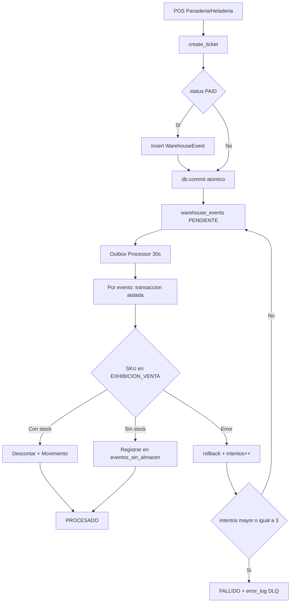
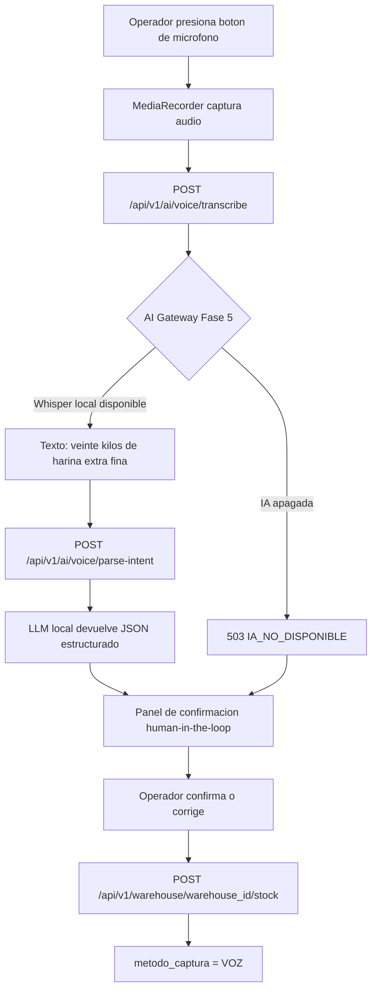
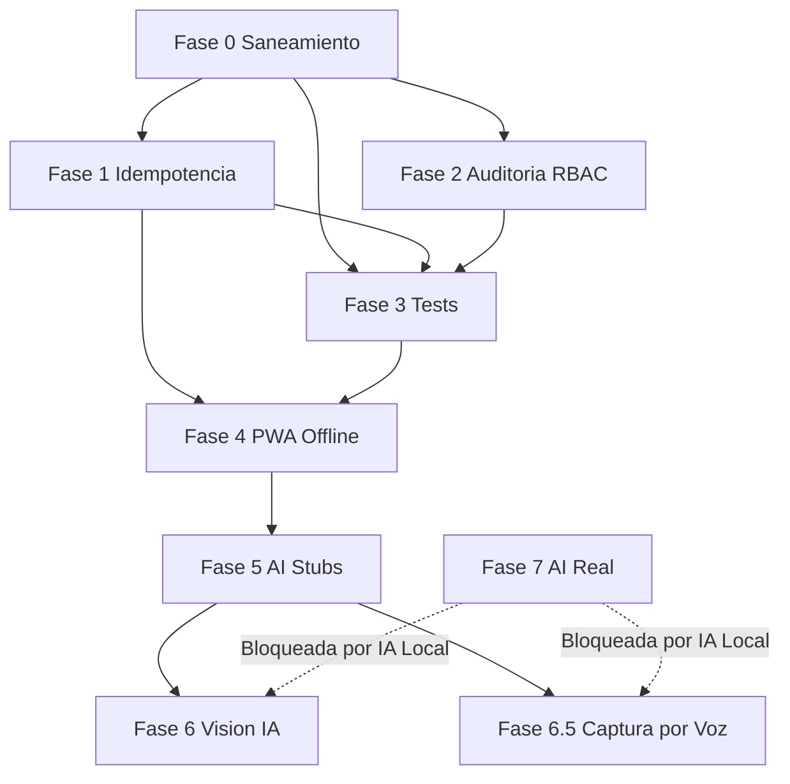
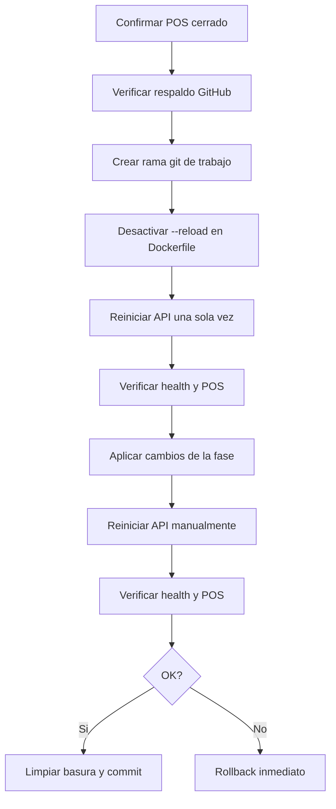

# PLAN MAESTRO REDISEÑADO — MÓDULO DE GESTIÓN DE ALMACENES
## ERP R de Rico — Versión 7.0

> **Autor:** Arquitecto Full-Stack Senior
> **Fecha:** 2026-09-13
> **Reemplaza a:** `PLAN_IMPLEMENTACION_ALMACENES_V5.md`
> **Modo:** INCREMENTAL con Fase 0 de saneamiento obligatoria
> **Estado del código:** Fases 1A–1F declaradas completas, pero con 11 defectos verificados

---

## 0. FILOSOFÍA DE ESTE REDISEÑO

El plan anterior (V5/V6) era un buen mapa de **qué construir**, pero un mal mapa de **en qué orden**. Declaraba fases completas que contenían defectos de integridad de datos, y priorizaba features vistosas (PWA, IA) sobre la corrección del núcleo.

Este rediseño parte de tres principios:

1. **El inventario es un libro contable inmutable.** Un doble descuento o una pérdida silenciosa es un error financiero, no un bug cosmético.
2. **No se construye sobre arena.** La PWA offline amplifica cualquier defecto de idempotencia del backend. Primero se corrige el núcleo.
3. **Lo que no se mide, no se controla.** Sin tests automatizados, cada cambio futuro es una apuesta.

> **Regla rectora:** *"Un dato perdido sin aviso es peor que un conflicto visible."* — Sección 3.3.5 del Contexto Maestro.

---

## 1. AUDITORÍA FORENSE DEL CÓDIGO ACTUAL

### 1.1 Defectos verificados (con evidencia en código)

| # | Severidad | Defecto | Evidencia | Impacto |
|---|---|---|---|---|
| **D1** | 🔴 Crítico | Outbox no idempotente ante fallo parcial: el loop de items modifica stock en sesión; si un item falla, el `except` no hace rollback y el evento queda PENDIENTE con stock ya descontado | [`service.py`](apps/api/modules/warehouse/service.py:345) | **Doble descuento de inventario** al reprocesar |
| **D2** | 🔴 Crítico | SKUs sin stock en almacén se ignoran silenciosamente y el evento se marca PROCESADO | [`service.py`](apps/api/modules/warehouse/service.py:368) | **Pérdida silenciosa de trazabilidad** |
| **D3** | 🟠 Alto | `datetime.utcnow()` prohibido explícitamente y deprecado en Python 3.12+ | [`models.py`](apps/api/modules/warehouse/models.py:29) | Inconsistencia de timestamps, deuda técnica |
| **D4** | 🟠 Alto | `usuario_id: 'VICTOR'` hardcodeado en el frontend | [`WarehouseManagerUI.jsx`](apps/inventory/WarehouseManagerUI.jsx:192) | **Auditoría de mermas inútil** |
| **D5** | 🟠 Alto | Frontend llama a `POST /{id}/items` que no existe (el correcto es `/{id}/stock`) | [`WarehouseManagerUI.jsx`](apps/inventory/WarehouseManagerUI.jsx:374) | Función muerta, falla silenciosa |
| **D6** | 🟡 Medio | `print()` en producción en lugar de `logger.info()` | [`main.py`](apps/api/main.py:77) | Viola sección 7.1 del Contexto Maestro |
| **D7** | 🟠 Alto | `register_movement` no incrementa `version` al actualizar stock existente | [`service.py`](apps/api/modules/warehouse/service.py:111) | **Rompe el bloqueo optimista** |
| **D8** | 🟠 Alto | `register_transfer` no incrementa `version` en origen ni destino | [`service.py`](apps/api/modules/warehouse/service.py:141) | **Rompe el bloqueo optimista** |
| **D9** | 🟠 Alto | `register_bulk_entry` no incrementa `version` al crear stock nuevo | [`service.py`](apps/api/modules/warehouse/service.py:236) | Inconsistencia de versión |
| **D10** | 🟡 Medio | N+1 queries en `get_warehouse_stock`: un SELECT por cada item del stock | [`service.py`](apps/api/modules/warehouse/service.py:69) | Lentitud con inventarios grandes |
| **D11** | 🟡 Medio | `console.error` y `alert()` en el frontend en lugar de `logger` | [`WarehouseManagerUI.jsx`](apps/inventory/WarehouseManagerUI.jsx:64) | Viola sección 7.1 |

### 1.2 Hallazgos estructurales

| Hallazgo | Detalle |
|---|---|
| **Cero tests** | No existe ningún archivo de test para el módulo de almacenes |
| **Sin auditoría** | Las operaciones sensibles (merma, traspaso, ajuste) no insertan en la tabla `auditoria` (sección 14 del Contexto Maestro) |
| **Sin RBAC** | Los endpoints no validan permisos; cualquier usuario autenticado puede registrar mermas |
| **`EQUIPAMIENTO` huérfano** | El enum `PropositoAlmacen` incluye `EQUIPAMIENTO` en [`schemas.py`](apps/api/modules/warehouse/schemas.py:14) pero no está documentado ni usado |
| **Sin `tenant_id`** | Preparación SaaS pendiente (sección 19 del Contexto Maestro) |
| **`warehouse_events` sin `sucursal_id`** | Impide trazabilidad multi-sucursal futura |

---

## 2. ARQUITECTURA OBJETIVO

### 2.1 Diagrama de flujo corregido



### 2.2 Principios de diseño inamovibles

| Principio | Implementación |
|---|---|
| **Idempotencia real** | Clave de deduplicación `(ticket_id, sku)` en `movimientos_inventario` |
| **Transacción por evento** | Cada evento se procesa en su propia transacción con rollback explícito |
| **Nunca silenciar** | SKU sin almacén se registra en tabla de diagnóstico, no se descarta |
| **Bloqueo optimista consistente** | Toda mutación de `stock_almacen` incrementa `version` |
| **No-interferencia POS** | `try/except pass` en toda integración |
| **Auditoría obligatoria** | Merma, traspaso y ajuste insertan en `auditoria` en la misma transacción |

---

## 3. FASES REDISEÑADAS

### Resumen ejecutivo

| Fase | Nombre | Riesgo | Dependencia | Bloquea a |
|---|---|---|---|---|
| **0** | Saneamiento del núcleo | 🟡 Medio | Ninguna | Todas |
| **0.5** | Unificación de la fuente de verdad del stock | 🔴 Alto | Fase 0 | Fase 1 |
| **1** | Idempotencia y trazabilidad del Outbox | 🔴 Alto | Fases 0, 0.5 | Fase 4 |
| **2** | Auditoría y RBAC | 🟡 Medio | Fase 0 | — |
| **3** | Tests automatizados | 🟢 Bajo | Fases 0–2 | — |
| **4** | PWA Offline (cola + SW + manifest) | 🟡 Medio | Fases 1, 3 | Fase 5 |
| **5** | AI Gateway stubs | 🟢 Bajo | Fase 4 | Fase 6 |
| **6** | Escáner IA de visión | 🟡 Medio | Fase 5 | — |
| **7** | AI Gateway real | 🔴 Alto | Módulo IA Local | — |

> **Nota sobre la Fase 0.5:** Es una fase nueva, añadida tras la decisión arquitectónica del usuario (Opción B). Resuelve el conflicto de doble fuente de verdad entre `products.stock` y `stock_almacen.cantidad_actual`. Es **prerequisito** de la Fase 1 porque el Outbox no puede ser idempotente si no está claro cuál es el stock verdadero.

---

## FASE 0 — SANEAMIENTO DEL NÚCLEO

> **Objetivo:** Corregir los 11 defectos verificados antes de construir cualquier cosa nueva.
> **Criterio de salida:** Cero defectos de la tabla 1.1 abiertos. POS operando sin afectación.

### 0.1 Corregir bloqueo optimista inconsistente (D7, D8, D9)

**Archivo:** [`service.py`](apps/api/modules/warehouse/service.py:89)

**Problema:** Tres métodos mutan `cantidad_actual` sin incrementar `version`, lo que invalida el bloqueo optimista para cualquier cliente que tenga la versión cacheada.

**Acción:**
- `register_movement` → incrementar `version` en la rama `else` (stock existente)
- `register_transfer` → incrementar `version` en `stock_origen` y `stock_destino`
- `register_bulk_entry` → incrementar `version` también al crear stock nuevo (iniciar en 1 explícito)

**Regla derivada:** *Toda mutación de `cantidad_actual` DEBE incrementar `version` en la misma operación. Sin excepciones.*

### 0.2 Corregir `datetime.utcnow()` (D3)

**Archivo:** [`models.py`](apps/api/modules/warehouse/models.py:29)

**Acción:**
- Reemplazar los 5 usos de `datetime.datetime.utcnow` por `datetime.datetime.now`
- Crear migración Alembic si el cambio de default requiere alteración de columna
- Verificar que no existan datos históricos con timestamps inconsistentes

**Regla derivada:** *Prohibido `utcnow()`. Usar `datetime.now()` (que en Docker = UTC).*

### 0.3 Corregir endpoint inexistente en frontend (D5)

**Archivo:** [`WarehouseManagerUI.jsx`](apps/inventory/WarehouseManagerUI.jsx:374)

**Acción:**
- Cambiar `POST /api/v1/warehouse/${id}/items` → `POST /api/v1/warehouse/${id}/stock`
- Verificar que el payload coincida con `MovimientoInventarioCreate`
- Eliminar la función si resulta redundante con el flujo de entrada masiva

### 0.4 Corregir `usuario_id` hardcodeado (D4)

**Archivo:** [`WarehouseManagerUI.jsx`](apps/inventory/WarehouseManagerUI.jsx:192)

**Acción:**
- Derivar `usuario_id` de la sesión activa (hook `usePermisos` o contexto de usuario)
- Aplicar en los 3 flujos: merma, traspaso, entrada masiva
- Si no hay sesión, bloquear la operación con mensaje claro

**Regla derivada:** *Prohibido hardcodear identidad de usuario. Toda operación auditable deriva el actor de la sesión.*

### 0.5 Reemplazar `print()` y `console.error`/`alert()` (D6, D11)

**Acciones:**
- Backend: `print()` → `logger.info()` en [`main.py`](apps/api/main.py:77)
- Frontend: `console.error` → `logger.error` desde `shared/utils/logger`
- Frontend: `alert()` → sistema de notificación no bloqueante (toast)

### 0.6 Optimizar N+1 en `get_warehouse_stock` (D10)

**Archivo:** [`service.py`](apps/api/modules/warehouse/service.py:63)

**Acción:**
- Recolectar todos los `item_id` de tipo PRODUCTO y hacer un solo `SELECT WHERE sku IN (...)`
- Recolectar todos los `item_id` de tipo INSUMO y hacer un solo `SELECT WHERE id IN (...)`
- Construir un diccionario de lookup y enriquecer en memoria

**Patrón de referencia:** El mismo que ya usa el POS en `_get_items_and_total` (v7.0).

### 0.7 Resolver enum `EQUIPAMIENTO` huérfano

**Acción:** Decidir y documentar:
- **Opción A:** Eliminarlo si no tiene caso de uso
- **Opción B:** Documentarlo en la especificación si representa equipos (refrigeradores, cámaras) que no son inventario vendible

### 0.8 Verificación de Fase 0

- [ ] Los 3 métodos incrementan `version` correctamente
- [ ] Cero usos de `datetime.utcnow()` en el módulo
- [ ] Cero endpoints inexistentes llamados desde el frontend
- [ ] Cero `usuario_id` hardcodeados
- [ ] Cero `print()` / `console.error` / `alert()` en el módulo
- [ ] `get_warehouse_stock` ejecuta máximo 3 queries (stock + productos + insumos)
- [ ] POS panadería y heladería operando sin afectación
- [ ] Respaldo verificado (código en GitHub + data respaldada)

---

## FASE 0.5 — UNIFICACIÓN DE LA FUENTE DE VERDAD DEL STOCK

> **Objetivo:** Eliminar el conflicto de doble fuente de verdad entre `products.stock` y `stock_almacen.cantidad_actual`.
> **Criterio de salida:** Existe una sola fuente de verdad del stock. El catálogo ya no almacena inventario.
> **Prerequisito:** Fase 0 completa.
> **Decisión arquitectónica del usuario:** **Opción B** — el catálogo es solo el maestro de productos; almacenes es el maestro de stock.

### 0.5.1 El problema (doble fuente de verdad)

| Fuente | Archivo | Campo | Rol actual |
|---|---|---|---|
| Catálogo de Productos | [`catalog/models.py`](apps/api/modules/catalog/models.py:26) | `stock` | "Inventario físico actual en piezas" |
| Gestión de Almacenes | [`warehouse/models.py`](apps/api/modules/warehouse/models.py:39) | `cantidad_actual` | Stock por almacén y por SKU |

Además, [`catalog/models.py`](apps/api/modules/catalog/models.py:27) línea 27 tiene `warehouse = Column(String, default="Bóveda Central")` — un almacén **hardcodeado**, que viola el principio SaaS "NADA HARDCODEADO".

**Consecuencia:** Al vender, el POS descuenta de `products.stock` y el Outbox descuenta de `stock_almacen.cantidad_actual`. Los dos números divergen y ninguno es confiable.

### 0.5.2 La decisión: Opción B

**Principio de responsabilidad única aplicado:**

| Módulo | Responde a la pregunta | Campos que conserva |
|---|---|---|
| **Catálogo** | ¿Qué es este producto? | `sku`, `name`, `price`, `cost`, `image_url`, `nature`, `category_id`, `active` |
| **Almacenes** | ¿Cuánto hay y dónde? | `cantidad_actual`, `almacen_id`, `item_id`, `version` |

**El catálogo deja de almacenar inventario.** Su campo `stock` se deprecia.

### 0.5.3 Acciones de la Fase 0.5

**A. Deprecar `products.stock`**

- Marcar la columna como obsoleta (comentario en el modelo + documentación)
- **No eliminarla de inmediato** (evita romper queries existentes y permite rollback)
- Planificar su eliminación física en una fase posterior, cuando ninguna pantalla la lea

**B. Deprecar `products.warehouse`**

- Eliminar el valor hardcodeado `"Bóveda Central"`
- La ubicación real vive en `stock_almacen.almacen_id`

**C. Auditar todos los lectores de `products.stock`**

- Buscar en backend: `\.stock` en `modules/pos/`, `modules/catalog/`, `modules/analytics/`
- Buscar en frontend: `product.stock` en `apps/pos/`, `apps/inventory/`
- Documentar cada punto de lectura y su reemplazo por la consulta a almacenes

**D. Crear endpoint agregado de stock**

- `GET /api/v1/warehouse/stock-por-sku/{sku}` → devuelve la suma de `cantidad_actual` de todos los almacenes para ese SKU
- Este endpoint se convierte en la **única** forma de consultar el stock total de un producto

**E. Migrar datos existentes**

- Para cada producto con `stock > 0`, crear o actualizar su registro en `stock_almacen` del almacén correspondiente
- Script de migración idempotente (verificar antes de insertar)
- **Nunca borrar datos**: si hay discrepancia entre `products.stock` y `stock_almacen`, registrar la diferencia en un log de auditoría antes de decidir cuál prevalece

### 0.5.4 Regla derivada

> **Toda consulta de stock total de un producto DEBE pasar por el módulo de almacenes. El catálogo nunca responde "cuánto hay".**

### 0.5.5 Verificación de Fase 0.5

- [ ] `products.stock` está marcado como obsoleto y documentado
- [ ] `products.warehouse` ya no tiene valor hardcodeado
- [ ] Existe `GET /api/v1/warehouse/stock-por-sku/{sku}` funcionando
- [ ] Todos los lectores de `products.stock` fueron identificados y documentados
- [ ] Los datos existentes fueron migrados a `stock_almacen` sin pérdida
- [ ] Las discrepancias detectadas quedaron registradas en el log de auditoría
- [ ] El POS sigue operando sin afectación

---

## FASE 1 — IDEMPOTENCIA Y TRAZABILIDAD DEL OUTBOX

> **Objetivo:** Garantizar que un evento nunca descuente stock dos veces y que ningún SKU se pierda silenciosamente.
> **Criterio de salida:** Reprocesar un evento fallido no altera el stock. Todo SKU sin almacén es visible.
> **Prerequisito:** Fases 0 y 0.5 completas.

### 1.1 Transacción aislada por evento (D1)

**Archivo:** [`service.py`](apps/api/modules/warehouse/service.py:321)

**Problema actual:** El loop de items comparte la sesión. Un fallo parcial deja stock modificado sin commit, y el evento queda PENDIENTE para reprocesarse.

**Diseño corregido:**

```
Para cada evento:
    try:
        iniciar transacción aislada (savepoint o sesión propia)
        procesar todos los items
        marcar PROCESADO
        commit
    except:
        rollback completo del evento
        intentos += 1
        si intentos >= 3: FALLIDO + error_log
        commit del contador de intentos
```

**Decisión de diseño:** Usar una sesión nueva por evento (`AsyncSessionLocal()`) en lugar de savepoints, porque es más simple de razonar y el volumen es bajo (máx 50 eventos por ciclo).

### 1.2 Clave de deduplicación (idempotencia real)

**Migración Alembic requerida:**

Agregar a `movimientos_inventario`:
- Columna `evento_id` (Integer, nullable, FK a `warehouse_events.id`)
- Índice único compuesto `idx_mov_evento_item` sobre `(evento_id, item_id)`

**Lógica:**
- Antes de descontar un SKU, verificar si ya existe un movimiento con ese `(evento_id, item_id)`
- Si existe → saltar (ya procesado)
- Si no existe → descontar y registrar

**Por qué es necesario:** Aunque el `ticket_id` es UNIQUE en `warehouse_events`, el reprocesamiento de un evento PENDIENTE puede re-aplicar items que ya se aplicaron antes del fallo. La clave compuesta garantiza idempotencia a nivel de item.

### 1.3 Tabla de diagnóstico para SKUs sin almacén (D2)

**Migración Alembic requerida:**

Nueva tabla `warehouse_eventos_sin_almacen`:

| Campo | Tipo | Descripción |
|---|---|---|
| `id` | Integer PK SERIAL | Autoincremental |
| `evento_id` | Integer FK | Evento que lo originó |
| `ticket_id` | Integer | Ticket de la venta |
| `sku` | String | SKU vendido sin almacén asignado |
| `cantidad` | Float | Cantidad vendida |
| `created_at` | DateTime | Cuándo se detectó |
| `resuelto` | Boolean | Si ya se asignó almacén |

**Lógica:** Cuando el procesador no encuentra stock para un SKU, inserta un registro aquí en lugar de ignorarlo. El evento se marca PROCESADO (la venta no es un error), pero el SKU queda visible para el gerente.

**Nuevo endpoint:** `GET /api/v1/warehouse/diagnostico/sin-almacen` — lista los SKUs huérfanos.

**Por qué es necesario:** Convierte una pérdida silenciosa en un dato accionable. Cumple la regla "un dato perdido sin aviso es peor que un conflicto visible".

### 1.4 Agregar `sucursal_id` a `warehouse_events`

**Migración Alembic requerida:** Columna `sucursal_id` (String, nullable) para preparación multi-sucursal (sección 3.3.4 del Contexto Maestro).

### 1.5 Verificación de Fase 1

- [ ] Simular fallo a mitad de un evento → verificar rollback completo
- [ ] Reprocesar un evento ya aplicado → verificar que no descuenta de nuevo
- [ ] Vender un SKU sin almacén → verificar registro en tabla de diagnóstico
- [ ] `GET /diagnostico/sin-almacen` devuelve los SKUs huérfanos
- [ ] POS operando sin afectación durante todas las pruebas

---

## FASE 2 — AUDITORÍA Y RBAC

> **Objetivo:** Cumplir las secciones 13 y 14 del Contexto Maestro.
> **Criterio de salida:** Toda operación sensible queda auditada y protegida por permisos.

### 2.1 Auditoría de operaciones sensibles

**Operaciones a auditar:**

| Operación | Permiso requerido | Motivo de auditoría |
|---|---|---|
| Registrar merma | `almacenes.merma` | Pérdida económica directa |
| Ejecutar traspaso | `almacenes.traspaso` | Movimiento de valor entre ubicaciones |
| Ajuste de inventario | `almacenes.ajuste` | Corrección manual de conteo |
| Eliminar almacén | `almacenes.eliminar` | Destructivo |
| Editar stock directamente | `almacenes.editar_stock` | Sobreescritura de verdad |

**Implementación:**
- Insertar en la tabla `auditoria` **en la misma transacción SQL** que la operación
- Registrar: usuario, acción, entidad afectada, valores antes/después, timestamp

### 2.2 Validación de permisos en backend

**Patrón obligatorio:** `verificar_permiso(usuario, permiso="almacenes.merma")`

**Regla absoluta:** El backend valida independientemente. Nunca confiar en que el frontend oculta el botón (sección 4.4 del Contexto Maestro — Defensa en Profundidad).

### 2.3 Verificación de Fase 2

- [ ] Cada merma genera un registro en `auditoria`
- [ ] Un usuario sin permiso recibe HTTP 403 al intentar una merma
- [ ] El frontend oculta los botones sin permiso (capa 1)
- [ ] El backend rechaza aunque el frontend sea manipulado (capa 3)

---

## FASE 3 — TESTS AUTOMATIZADOS

> **Objetivo:** Blindar la lógica crítica contra regresiones futuras.
> **Criterio de salida:** Cobertura de la lógica de negocio crítica con `pytest`.

### 3.1 Tests de backend (`pytest`)

| Área | Casos de prueba |
|---|---|
| **Bloqueo optimista** | Versión correcta → 200; versión incorrecta → 409; versión se incrementa tras cada mutación |
| **Idempotencia Outbox** | Reprocesar evento no duplica movimientos; fallo parcial hace rollback |
| **Mermas** | Merma mayor al stock → 400; merma válida descuenta y registra movimiento |
| **Traspasos** | Stock insuficiente → 400; traspaso válido mueve stock en ambos almacenes |
| **Entrada masiva** | Todos los items comparten `lote_entrada_id`; versiones se incrementan |
| **SKU sin almacén** | Se registra en tabla de diagnóstico, evento se marca PROCESADO |
| **Integridad** | No se puede eliminar almacén con stock > 0 |

### 3.2 Tests de frontend (`Vitest`)

| Área | Casos de prueba |
|---|---|
| Mapeo de campos API español → UI inglés | Campos mapeados correctamente |
| Validación de formularios | Campos obligatorios bloquean el submit |
| Cálculo de alertas PEPS | Días en anaquel vs umbral |

### 3.3 Verificación de Fase 3

- [ ] `pytest` pasa sin errores
- [ ] `vitest` pasa sin errores
- [ ] Los tests cubren los 11 defectos corregidos (test de regresión por cada uno)

---

## FASE 4 — PWA OFFLINE

> **Objetivo:** Operación sin red con sincronización automática.
> **Prerequisito:** Fases 1 y 3 completas (el backend ya es idempotente).
> **Criterio de salida:** Registrar una merma sin red y verificar que se sincroniza al reconectar sin duplicados.

### 4.1 `offlineQueue.js` — Cola de sincronización

**Ubicación:** `apps/inventory/services/offlineQueue.js`

**Capacidades:**

| Funcionalidad | Offline | Sync al reconectar |
|---|---|---|
| Ver almacenes y stock (caché) | Sí | Auto-refresh |
| Registrar entrada de stock | Sí (cola local) | Auto-sync |
| Registrar merma | Sí (cola local) | Auto-sync |
| Crear almacén | No (requiere servidor) | — |
| Escáner IA | No (requiere servidor) | — |

**Reglas de diseño obligatorias:**
- Cada operación encolada lleva: `uuid` de cliente, `timestamp_local`, `sucursal_id`, `origen: 'warehouse_offline'`
- Derivar URLs de `CONFIG.API_BASE_URL` — prohibido construir manualmente (Incidente 16.6)
- Detección de conectividad vía `navigator.onLine` + heartbeat real
- La cola no bloquea la UI; aplica optimista y reconcilia al sincronizar
- **Idempotencia:** el `uuid` de cliente se envía al backend para deduplicación

### 4.2 `public/sw.js` — Service Worker

**Estrategia de caché:**

| Recurso | Estrategia |
|---|---|
| App shell (HTML, JS, CSS) | Cache-first con revalidación en background |
| `GET /api/v1/warehouse/` | Stale-while-revalidate |
| `GET /{id}/stock` | Stale-while-revalidate |
| `POST/PUT/DELETE` | Network-only, delega a `offlineQueue.js` |

**⚠️ REGLA CRÍTICA DE SEGURIDAD:** El Service Worker **NUNCA** debe interceptar ni cachear endpoints de `/api/v1/pos/`. Un SW mal scopeado puede romper el cobro — el corazón económico del negocio. El scope debe limitarse estrictamente al módulo de almacenes.

### 4.3 `public/manifest.json` — PWA

**Campos:** `name`, `short_name`, `start_url`, `display: standalone`, `theme_color`, `background_color`, `icons` (192×192 y 512×512).

**Nota SaaS:** `name` y `theme_color` deben derivarse de `system_settings` (`business_name`), no hardcodearse (sección 19 del Contexto Maestro).

### 4.4 Indicador de estado de red

**Regla crítica (Incidente 16.1):** Prohibido `animate-pulse` u otras animaciones CSS de bucle infinito en indicadores de conectividad. Usar solo `animate-in` de montaje único.

### 4.5 Verificación de Fase 4

- [ ] Cortar WiFi → registrar merma → reconectar → sync sin duplicados
- [ ] Verificar que el POS sigue cobrando con el SW activo
- [ ] Verificar que el SW no cachea endpoints del POS
- [ ] Verificar que el indicador de red no produce efecto estrobo

---

## FASE 5 — AI GATEWAY STUBS

> **Objetivo:** Preparar la UI para IA con fallback graceful.
> **Criterio de salida:** Con IA apagada, la UI muestra un toast y no se congela.

### 5.1 Módulo `apps/api/modules/ai/`

**Endpoints stub:**

| Método | Ruta | Descripción |
|---|---|---|
| `POST` | `/api/v1/ai/vision/detect` | Proxy visión con fallback |
| `POST` | `/api/v1/ai/voice/transcribe` | Proxy Whisper con fallback |
| `POST` | `/api/v1/ai/voice/parse-intent` | NLU texto → intención JSON |

**Comportamiento del stub:** Si el servicio de IA no está disponible, responde `503 IA_NO_DISPONIBLE`. La UI traduce a un toast informativo. El módulo sigue funcionando en modo manual.

**Regla crítica:** Registrar el módulo en `main.py` e importar sus modelos para evitar el crash loop del Incidente 16.3.

### 5.2 Verificación de Fase 5

- [ ] Con IA apagada, la UI muestra toast sin congelarse
- [ ] El servidor arranca sin errores con el módulo AI registrado
- [ ] El POS no se ve afectado

---

## FASE 6 — ESCÁNER IA DE VISIÓN

> **Objetivo:** Contar productos en una charola mediante una foto.
> **Prerequisito:** Fase 5 completa.
> **Criterio de salida:** La IA propone cantidades y el operador confirma antes de registrar.

### 6.1 Auditar código de visión existente (DRY)

**Antes de construir:** Auditar [`packages/vision/`](packages/vision/vision_counts.js) — contiene `camera_stream.js`, `vision_counts.js` e `industrial_camera_config.json`. Evaluar qué es reutilizable.

#### ✅ Resultado de la auditoría (ejecutada)

| Archivo | Veredicto | Motivo |
|---|---|---|
| [`packages/vision/vision_counts.js`](packages/vision/vision_counts.js:11) | ❌ **NO reutilizable** | `processFrameAndCount()` devuelve detecciones **hardcodeadas** (`concha-vainilla 0.98`, `bolillo 0.95`, `donas-chocolate 0.92`). Es un mock de demo, no un motor. `syncTrayWithPOS()` solo invoca un callback. |
| [`packages/vision/camera_stream.js`](packages/vision/camera_stream.js:11) | ⚠️ **Parcialmente reutilizable** | `CameraService` es un wrapper delgado de `getUserMedia` con constraints 4K/60fps. Útil como referencia, pero el frontend ya usa `<input type="file" capture="environment">`, que es más simple y no requiere permisos persistentes. |
| [`packages/vision/industrial_camera_config.json`](packages/vision/industrial_camera_config.json:1) | ❌ **NO reutilizable** | Config de hardware (Sony IMX179) sin ningún consumidor. |

**Hallazgo crítico:** `packages/vision/` es **código muerto** — cero importaciones en todo `apps/` (verificado por búsqueda). No se debe construir sobre él.

**Motor real ya existente (SÍ reutilizable):**

- [`apps/api/modules/pos/service.py:838`](apps/api/modules/pos/service.py:838) — `predict_vision()` es un motor **real** de visión por computadora: decodifica la imagen con OpenCV, extrae descriptores **ORB** (`cv2.ORB_create(nfeatures=500)`) y los compara contra el dataset local en `apps/api/static/training/` usando `BFMatcher` (Hamming, `crossCheck=True`, umbral `distance < 45`). Devuelve `engine="local"` y `latency_ms`.
- [`apps/api/modules/pos/router.py:467`](apps/api/modules/pos/router.py:467) — `POST /api/v1/pos/vision/predict` ya está expuesto.
- [`apps/api/modules/pos/service.py:806`](apps/api/modules/pos/service.py:806) — `upload_training_images()` ya persiste el dataset de entrenamiento por SKU.

**Decisión DRY:** **NO** se construye un motor nuevo. La Fase 6 **reutiliza** el motor ORB existente y le agrega la capa que falta: el mapeo a `metodo_captura = VISION_SNAPSHOT` y la confirmación human-in-the-loop en el módulo de almacenes. `packages/vision/` queda marcado como obsoleto y no se toca.

### 6.2 Backend — Endpoint de predicción

- `POST /api/v1/pos/vision/predict` recibe imagen, devuelve `[{sku, cantidad, confianza}]`
- El `MovimientoInventario` resultante usa `metodo_captura = VISION_SNAPSHOT`
- Envolver en `try/except` para no interrumpir el POS

### 6.3 Frontend — Captura y confirmación

- Botón "Escanear Charola" en la pestaña de entrada de stock
- Usar `navigator.mediaDevices.getUserMedia` o `<input type="file" capture="environment">`
- Preview con overlay de detecciones antes de confirmar

### 6.4 Regla human-in-the-loop

**La IA propone, el operador confirma.** Nunca registrar stock automáticamente sin confirmación humana. La confianza de la IA es una sugerencia, no una verdad.

### 6.5 Verificación de Fase 6

- [x] La IA detecta productos en una foto de prueba
- [x] El operador puede corregir cantidades antes de confirmar
- [x] El movimiento se registra con `metodo_captura = VISION_SNAPSHOT`
- [x] Con IA apagada, el flujo manual sigue funcionando

#### ✅ Resultado de la implementación (ejecutada)

**Backend (6.2):**

| Artefacto | Detalle |
|---|---|
| [`apps/api/modules/warehouse/schemas.py:206`](apps/api/modules/warehouse/schemas.py:206) | `VisionSnapshotItem` (cantidad `gt=0`, confianza `0..1`), `VisionSnapshotRequest`, `VisionSnapshotResponse` |
| [`apps/api/modules/warehouse/service.py:424`](apps/api/modules/warehouse/service.py:424) | `register_vision_snapshot()` — crea `MovimientoInventario` con `metodo_captura=VISION_SNAPSHOT`, lote `VIS-<hex>`, bloqueo optimista (`version += 1`) |
| [`apps/api/modules/warehouse/router.py:97`](apps/api/modules/warehouse/router.py:97) | `POST /api/v1/warehouse/{warehouse_id}/entrada-vision` |
| [`apps/api/modules/pos/router.py:467`](apps/api/modules/pos/router.py:467) | `POST /api/v1/pos/vision/predict` endurecido con `try/except` → `engine="unavailable"` si falla (el POS nunca se interrumpe) |

**Frontend (6.3):**

| Artefacto | Detalle |
|---|---|
| [`apps/inventory/utils/warehouseMappers.js:206`](apps/inventory/utils/warehouseMappers.js:206) | `mapVisionDetectionsToProposals()` (todo nace `confirmado:false`), `validateVisionSnapshot()`, `buildVisionSnapshotPayload()` |
| [`apps/inventory/utils/warehouseMappers.test.js`](apps/inventory/utils/warehouseMappers.test.js) | 12 tests nuevos de visión (total **57/57 PASS**) |
| [`apps/inventory/WarehouseManagerUI.jsx`](apps/inventory/WarehouseManagerUI.jsx) | Panel "📷 Escanear Charola (IA)" con `<input type="file" capture="environment">`, vista previa, panel de confirmación con checkbox + cantidad editable + descarte por línea |

**Evidencia de verificación:**

- `GET /health` → **200**
- `POST /api/v1/pos/vision/predict` → **200** `{"detections":[],"engine":"local","latency_ms":0.29}`
- `POST /api/v1/warehouse/alm_a2efcd56/entrada-vision` → **200** `{"lote_id":"VIS-a0bf146d","total_items":1,"metodo_captura":"VISION_SNAPSHOT"}`
- Persistencia en BD: `VIS-a0bf146d | harina_trigo | 3 | VISION_SNAPSHOT | ENTRADA_COMPRA`
- POS frontend `/index.html` → **200** (no interferencia)
- `pytest` → **21/21 PASS** · `vitest` → **57/57 PASS** · `vite build` → **OK (1417 módulos)**

---

## FASE 6.5 — CAPTURA DE INVENTARIO POR VOZ

> **Objetivo:** Registrar entradas, mermas y conteos dictando por voz, para operadores con las manos ocupadas.
> **Prerequisito bloqueante:** Instalación del módulo "IA Local" (Whisper + LLM) en el servidor.
> **Criterio de salida:** El operador dicta, la IA propone un JSON estructurado, el operador confirma y el movimiento se registra con `metodo_captura = VOZ`.
> **Estado actual:** Solo existe un esqueleto de UI. El motor real NO existe.

### 6.5.1 Hallazgo de auditoría — el agente de voz actual es un MOCK

Auditoría de [`apps/voice-agent/VoiceAgentService.js`](apps/voice-agent/VoiceAgentService.js:13):

| Hallazgo | Evidencia | Impacto |
|---|---|---|
| No captura audio | `processQuery(voiceInput)` recibe texto ya transcrito | No hay integración con micrófono |
| No consulta la BD | [`getTodaysMargin()`](apps/voice-agent/VoiceAgentService.js:52) devuelve `"margen del 34%"` hardcodeado | Viola la regla SaaS de no hardcodear |
| Datos inventados | [`getCriticalInventory()`](apps/voice-agent/VoiceAgentService.js:68) devuelve `"Harina Extra Fina 15kg"` fijo | Información falsa al usuario |
| Sin NLU real | Es una cadena de `if (input.includes(...))` | No entiende lenguaje natural |

**Conclusión:** hay estructura de intenciones y UI, pero cero conexión a datos reales y cero captura de audio. Es un esqueleto reutilizable, no un motor.

### 6.5.2 Lo que YA está listo (no hay que crearlo)

- El enum [`MetodoCaptura.VOZ`](apps/api/modules/warehouse/schemas.py:18) ya existe.
- Los endpoints stub ya están definidos en la Fase 5: `/api/v1/ai/voice/transcribe` y `/api/v1/ai/voice/parse-intent`.
- El caso de uso ya está documentado en [`seed_manuals.json:65`](packages/database/seed_manuals.json:65): *"Reportar faltantes de harina o azúcar al Gerente Operativo mediante comando de voz."*

### 6.5.3 Arquitectura objetivo



### 6.5.4 Contrato del parse-intent (JSON de ejemplo)

Entrada (texto transcrito): `"veinte kilos de harina extra fina"`

Salida esperada:

```json
{
  "item": "Harina Extra Fina",
  "sku": "INS-HAR-001",
  "cantidad": 20,
  "unidad": "kg",
  "tipo_movimiento": "ENTRADA_COMPRA",
  "confianza": 0.91,
  "texto_original": "veinte kilos de harina extra fina"
}
```

**Reglas del contrato:**

- Si `confianza < 0.70`, el panel de confirmación resalta el campo en amarillo y exige revisión explícita.
- Si el `sku` no se resuelve contra el catálogo, el panel muestra un selector para que el operador elija el producto.
- El campo `texto_original` se guarda en el movimiento para trazabilidad y para reentrenar el modelo.

### 6.5.5 Regla human-in-the-loop

**La IA propone, el operador confirma.** Idéntico principio que la visión (sección 6.4). Un error de transcripción ("quince" vs "cinco") descuadraría el inventario, por lo que **nunca** se registra stock automáticamente por voz.

### 6.5.6 Casos de uso reales

| Escenario | Dictado | Ventaja |
|---|---|---|
| Recepción de mercancía | "entrada de 2 bultos de harina" | Manos ocupadas descargando el camión |
| Conteo físico | "concha vainilla, 45 piezas" | Recorre estantes sin soltar la libreta |
| Merma | "merma de 3 bolillos quemados" | Registro inmediato en el punto de detección |
| Traspaso | "pasa 10 kilos de azúcar a Bóveda Central" | Sin navegar menús con las manos sucias |

### 6.5.7 Dependencia bloqueante

| Componente | Función | Estado |
|---|---|---|
| Whisper local | Audio → texto | ❌ No instalado |
| LLM local | Texto → JSON estructurado | ❌ No instalado |

Sin estos dos componentes, la captura por voz **no puede funcionar**. Por eso esta fase está bloqueada y se ejecuta junto con la Fase 7.

### 6.5.8 Qué SÍ se construye ahora (esqueleto con fallback)

Sin IA Local, se construye únicamente el esqueleto para que la UI esté lista:

- Botón de micrófono en la pestaña de entrada de stock.
- Al presionarlo, llama a `/api/v1/ai/voice/transcribe`.
- El stub responde `503 IA_NO_DISPONIBLE`.
- La UI muestra un toast: *"Dictado por voz no disponible. Capture manualmente."*
- **El flujo manual sigue funcionando perfectamente.**

Cuando se instale la IA Local, solo se reemplaza el stub por Whisper real y la UI ya está lista. No hay que rehacer nada.

### 6.5.9 Verificación de Fase 6.5

- [ ] Con IA apagada, el botón de micrófono muestra toast y no congela la UI
- [ ] El flujo manual de entrada de stock sigue funcionando sin la voz
- [ ] El POS no se ve afectado por el módulo de voz
- [ ] (Con IA Local) El dictado "20 kilos de harina" produce el JSON del contrato 6.5.4
- [ ] (Con IA Local) El operador puede corregir el SKU y la cantidad antes de confirmar
- [ ] (Con IA Local) El movimiento se registra con `metodo_captura = VOZ`
- [ ] (Con IA Local) El campo `texto_original` queda guardado en el movimiento

---

## FASE 7 — AI GATEWAY REAL

> **Objetivo:** Reemplazar stubs por Whisper + LLM local.
> **Prerequisito bloqueante:** Instalación del módulo "IA Local" en el servidor.
> **Nota:** Esta fase **no debería pertenecer al roadmap de almacenes**. Es un módulo transversal (POS, Almacenes, RRHH). Debe ser su propio proyecto con su propia especificación.

### 7.1 Componentes

| Componente | Endpoint | Caso de uso |
|---|---|---|
| Whisper local | `/voice/transcribe` | Dictar "20 kilos de harina" |
| LLM local | `/voice/parse-intent` | Texto → JSON estructurado |

**Regla SaaS:** El vocabulario y las palabras clave provienen de `system_settings`, nunca hardcodeados (sección 10 del Contexto Maestro).

### 7.2 Manejo de fallos

Si Whisper/LLM no responde, degradar a entrada manual con toast informativo. Nunca bloquear la operación de almacén por fallo de IA.

---

## 4. ORDEN DE EJECUCIÓN Y DEPENDENCIAS



### Secuencia recomendada

| Orden | Fase | Justificación |
|---|---|---|
| 1 | **Fase 0** | El núcleo debe ser correcto antes de ampliarlo |
| 2 | **Fase 1** | Prerequisito absoluto para offline |
| 3 | **Fase 2** | Cumplimiento normativo del Contexto Maestro |
| 4 | **Fase 3** | Blindaje contra regresiones |
| 5 | **Fase 4** | Ahora sí es seguro construir offline |
| 6 | **Fase 5** | Desbloquea visión y voz |
| 7 | **Fase 6** | Valor operativo real (conteo por imagen) |
| 8 | **Fase 6.5** | Esqueleto de voz con fallback; motor real bloqueado por IA Local |
| 9 | **Fase 7** | Depende de infraestructura externa |

---

## 5. PROTOCOLO DE SEGURIDAD POR FASE

1. **Respaldo de código vía GitHub** — el workflow [`mirror.yml`](.github/workflows/mirror.yml:1) replica cada push a un segundo repositorio. Red de seguridad principal para el código.
2. **Respaldo de data** — la data está respaldada en este equipo y en un repositorio dedicado de GitHub (criterio del usuario). El `pg_dump` fresco de tablas de almacenes es **opcional** y solo recomendado si se desea un punto de restauración exacto del día.
3. **Commit + push a GitHub** al final de cada fase, con número de versión y lista de mejoras
4. **Verificar POS panadería + heladería** después de cada cambio
5. **`try/except pass`** en toda integración con POS
6. **`React.lazy()`** si se agrega nuevo módulo al ExperimentCenter
7. **Migraciones Alembic** para todo cambio de schema — prohibido modificar schema manualmente
8. **Importar modelos en `main.py`** inmediatamente después de crearlos (Incidente 16.3)
9. **No dejar basura** — ver sección 5.2 (condición de aprobación del usuario)

---

## 5.1 PROTOCOLO DE NO-INTERFERENCIA CON EL POS (CRÍTICO)

> **Restricción absoluta del usuario:** *"NO DEBES MOLESTAR AL POS QUE ESTÁ OPERANDO EN ESTE MOMENTO."*
> Este protocolo es **obligatorio** y tiene prioridad sobre cualquier otra consideración de velocidad.

### 5.1.1 Análisis de riesgo verificado

| Factor de riesgo | Evidencia en código | Consecuencia si se ignora |
|---|---|---|
| **Recarga en vivo** | [`Dockerfile`](apps/api/Dockerfile:25) línea 25: `uvicorn main:app ... --reload` | **Cada guardado de un `.py` reinicia el API al instante** |
| **Bind mount** | [`docker-compose.yml`](docker-compose.yml:24) línea 24: `./apps/api:/app` | El contenedor lee los archivos locales directamente; no hay aislamiento |
| **API compartida** | [`POSService.js`](apps/pos/services/POSService.js:33) llama a `${CONFIG.API_BASE_URL}/pos/tickets` | El POS depende del **mismo** proceso que se reiniciaría |
| **BD compartida** | POS y Almacenes usan la misma PostgreSQL (`rderico-db-dev`) | Toda migración afecta tablas del POS |
| **Sin Service Worker** | Búsqueda de `serviceWorker|sw.js|workbox` → **0 resultados** | El POS **no tiene caché PWA** para sobrevivir a un reinicio del API |
| **Efectos en arranque** | [`main.py`](apps/api/main.py:84) `auto_seed_on_first_boot()` ejecuta `create_all` + `ALTER TABLE` en **cada** reinicio | Cada recarga re-ejecuta migraciones contra la BD viva |

### 5.1.2 Ventana de ejecución autorizada

- **Hora de cierre:** el usuario indicó esperar ~1 hora hasta el cierre de operaciones.
- **Regla:** Ninguna modificación de código ni reinicio del API se ejecuta mientras el POS esté cobrando.
- **Confirmación previa:** antes de tocar el primer archivo, confirmar explícitamente que el POS está cerrado.

### 5.1.3 Procedimiento de despliegue seguro (paso a paso)



**Detalle de cada paso:**

1. **Confirmar POS cerrado** — sin excepción.
2. **Verificar respaldo** — confirmar que el código está en GitHub (workflow mirror) y que la data está respaldada. El `pg_dump` fresco es opcional.
3. **Rama git de trabajo** — `git checkout -b feature/almacenes-v7-fase0`. Nunca trabajar sobre `main` en vivo.
4. **Desactivar `--reload`** — editar [`Dockerfile`](apps/api/Dockerfile:25) quitando `--reload`. Esto convierte "cada guardado = reinicio" en "reinicio solo cuando lo decidimos".
5. **Reiniciar API una sola vez** — `docker compose restart api` (o `up -d --build api`).
6. **Verificar `/health`** — `curl http://192.168.1.124:5001/health` debe responder `{"status":"ok"}`.
7. **Aplicar cambios de la fase** — solo archivos de `modules/warehouse/` y `apps/inventory/`.
8. **Reiniciar API manualmente** — un reinicio controlado por fase, no por archivo.
9. **Verificar `/health` y POS** — confirmar que el POS carga catálogo y puede abrir ticket.
10. **Limpiar basura y commit** — ejecutar la revisión de la sección 5.2, luego commit; **rollback** si algo falla.

### 5.1.4 Reglas de aislamiento (prohibiciones absolutas)

| Prohibición | Razón |
|---|---|
| **NUNCA editar archivos de `apps/pos/`** | El POS es intocable durante esta operación |
| **NUNCA modificar el bloque Outbox en [`pos/service.py`](apps/api/modules/pos/service.py:45)** | Es el único punto de integración; ya está protegido con `try/except pass` |
| **NUNCA ejecutar migraciones destructivas** (`DROP`, `ALTER` de tipo) | Solo columnas aditivas y nullable |
| **NUNCA reiniciar el contenedor `pos`** | Solo se reinicia `api`, y únicamente en ventana autorizada |
| **NUNCA trabajar sobre `main`** | Siempre rama de feature con rollback limpio |
| **NUNCA desplegar sin backup previo** | El backup es la red de seguridad final |

### 5.1.5 Migraciones seguras (patrón obligatorio)

Toda migración de Fase 1 debe seguir el patrón idempotente ya existente en [`main.py`](apps/api/main.py:104):

- Verificar existencia de la columna antes de crearla (`information_schema.columns`)
- Columnas nuevas: **nullable** o con `DEFAULT` — nunca `NOT NULL` sin default
- Tablas nuevas: aditivas, sin tocar tablas existentes del POS
- Probar la migración primero en una BD de prueba si es posible

### 5.1.6 Criterio de aborto (rollback)

Abortar y revertir inmediatamente si ocurre cualquiera de estos:

- `/health` no responde tras el reinicio
- El POS no carga catálogo o no puede abrir ticket
- Aparece un error en los logs del API relacionado con el POS
- Cualquier operación de almacén devuelve 500 de forma reproducible

**Comando de rollback:** `git checkout main && docker compose restart api`

---

## 5.2 REGLA DE HIGIENE: NO DEJAR BASURA (CONDICIÓN DEL USUARIO)

> **Instrucción explícita del usuario:** *"SOLO NO DEJES BASURA AL FINAL."*
> Esta regla es **condición de aprobación** del plan y aplica a todas las fases.

### 5.2.1 Prohibiciones de higiene

| Prohibición | Razón |
|---|---|
| **No dejar archivos temporales** (`temp_*.py`, `test_*.txt`, `error*.txt`, `*.bak`) | Contaminan el repositorio y confunden a futuros desarrolladores |
| **No dejar código comentado** ("por si acaso") | El historial de git ya lo conserva; el código muerto es ruido |
| **No dejar `print()` de depuración** | Se reemplazan por `logger` o se eliminan |
| **No dejar imports sin usar** | Violan las reglas de linting y del Contexto Maestro |
| **No dejar funciones huérfanas** | Si algo queda sin uso, se elimina (ej. la función del endpoint inexistente D5) |
| **No dejar ramas git abandonadas** | Se fusionan o se eliminan al terminar cada fase |
| **No dejar migraciones a medias** | Cada migración Alembic se completa o se revierte |
| **No dejar TODOs sin dueño** | Todo TODO se resuelve o se documenta en la sección 7 (Deuda Técnica) |

### 5.2.2 Limpieza obligatoria al cierre de cada fase

Antes del commit final de cada fase, ejecutar esta revisión:

- [ ] Buscar archivos temporales: `temp_*`, `*_backup.*`, `error*.txt`, `test_*.txt` → eliminar los generados durante la fase
- [ ] Buscar `print(` en el código modificado → reemplazar por `logger` o eliminar
- [ ] Buscar `console.log` / `console.error` / `alert(` en el frontend modificado → reemplazar por logger/toast
- [ ] Buscar `TODO` / `FIXME` / `XXX` en el código modificado → resolver o documentar
- [ ] Buscar imports sin usar en los archivos modificados → eliminar
- [ ] Verificar que no queden archivos `.pyc` o `__pycache__` rastreados por git
- [ ] Revisar `git status` → no debe haber archivos sin propósito en el commit

### 5.2.3 Nota sobre archivos preexistentes

El repositorio ya contiene archivos de depuración históricos (ej. `apps/api/error*.txt`, `apps/api/temp_*.xlsx`, `apps/api/api_logs_debug.txt`). **Estos NO son responsabilidad de este plan** y no se tocarán, para no mezclar limpieza histórica con el trabajo de almacenes. Solo se limpia **lo que este plan genere**.

---

## 6. CRITERIOS DE ACEPTACIÓN GLOBALES

| # | Criterio |
|---|---|
| 1 | Cero defectos de la tabla 1.1 abiertos |
| 2 | Reprocesar un evento fallido no altera el stock |
| 3 | Todo SKU sin almacén es visible en el diagnóstico |
| 4 | Toda operación sensible queda auditada |
| 5 | Toda operación sensible valida permisos en backend |
| 6 | `pytest` y `vitest` pasan sin errores |
| 7 | Registrar offline y sincronizar no duplica movimientos |
| 8 | El Service Worker no interfiere con el POS |
| 9 | Con IA apagada, la UI no se congela |
| 10 | El POS panadería y heladería operan sin afectación en todo momento |

---

## 7. DEUDA TÉCNICA ACEPTADA (documentada, no ignorada)

| Deuda | Razón de aceptación | Revisión futura |
|---|---|---|
| Sin `tenant_id` en tablas | Fase SaaS no iniciada | Cuando se agregue onboarding multi-tenant |
| `EQUIPAMIENTO` sin uso | Pendiente de decisión de negocio | Fase 0.7 |
| Polling 30s en lugar de eventos push | Simplicidad deliberada (decisión V5) | Si la latencia se vuelve problema |
| Sin conversión de unidades en almacenes | Decisión arquitectónica correcta | Nunca — pertenece a Producción |
| `WarehouseManagerUI.jsx` de 111 KB | Funciona; refactor es riesgo alto | Si se vuelve inmantenible |

---

## 8. DIFERENCIAS CLAVE vs PLAN V5/V6

| Aspecto | Plan V5/V6 | Plan V7 (este) |
|---|---|---|
| **Fase 0** | No existía | Saneamiento obligatorio de 11 defectos |
| **Idempotencia** | Asumida por `ticket_id UNIQUE` | Garantizada por clave compuesta `(evento_id, item_id)` |
| **SKU sin almacén** | Se ignora silenciosamente | Se registra en tabla de diagnóstico |
| **Transacción por evento** | Compartida (bug) | Aislada con rollback explícito |
| **Auditoría** | No contemplada | Fase 2 dedicada |
| **RBAC** | No contemplado | Fase 2 dedicada |
| **Tests** | 11 pasos manuales | Fase 3 con pytest + vitest |
| **Orden** | PWA primero | Núcleo primero, PWA después |
| **Fase 3 (IA real)** | Parte de almacenes | Marcada como proyecto transversal separado |
| **Reutilización visión** | No mencionada | Auditoría obligatoria de `packages/vision/` |

---

*FIN DEL PLAN MAESTRO V7.0*
